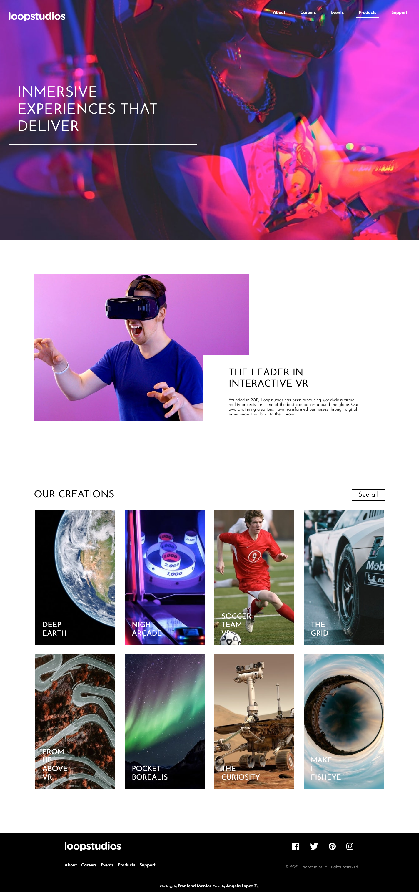

# Loopstudios landing page  

## Table of contents

- [Overview](#overview)
  - [The challenge](#the-challenge)
  - [Screenshot](#screenshot)
  - [Links](#links)
- [My process](#my-process)
  - [Built with](#built-with)
  - [Continued development](#continued-development)
- [Author](#author)

## Overview

Users should be able to:

- View the optimal layout for the site depending on their device's screen size
- See hover states for all interactive elements on the page

### Screenshot

### Links

- Solution URL: [Github Repo](https://github.com/glopzel/loopstudios)
- Live Site URL: [Github pages live site](https://glopzel.github.io/loopstudios/)

## My process

### Built with

- Semantic HTML5 markup
- CSS custom properties
- Flexbox
- CSS Grid

### Continued development

CSS cleanup.

## Author

- Frontend Mentor - [@glozpel](https://www.frontendmentor.io/profile/glozpel)
- Twitter - [@glozpel](https://www.twitter.com/glozpel)

